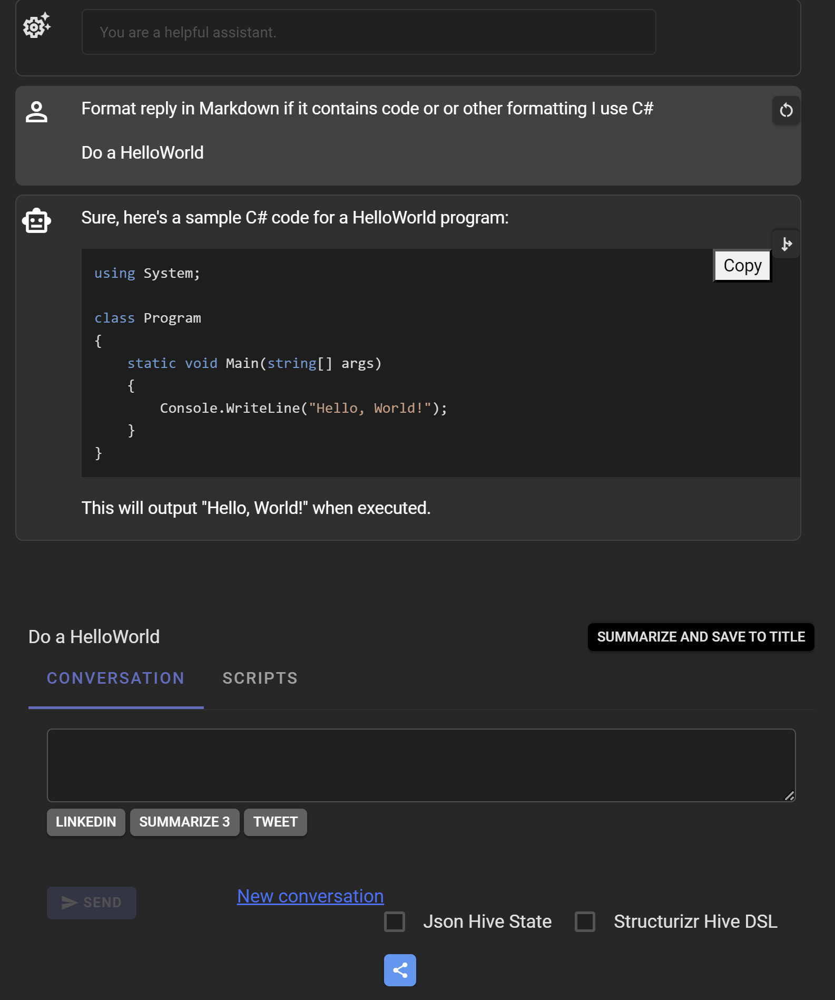
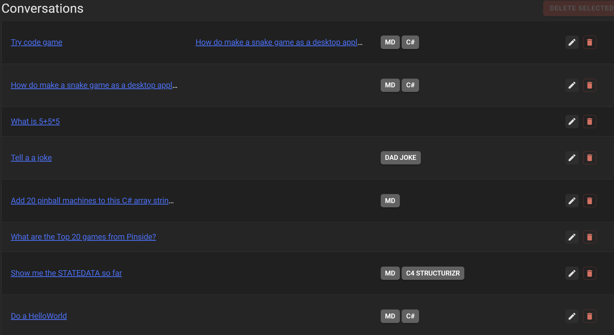
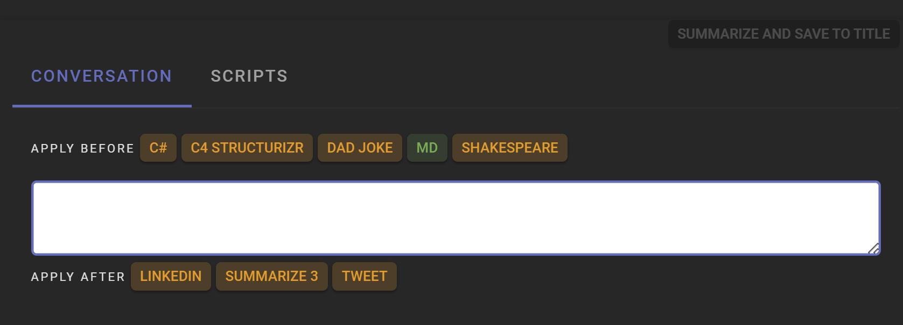
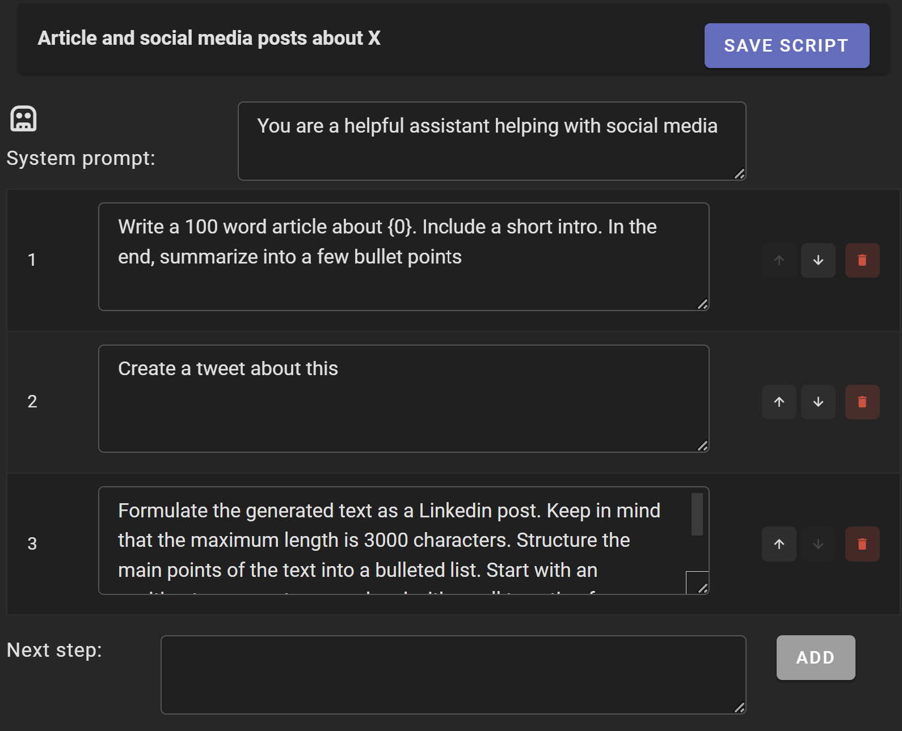
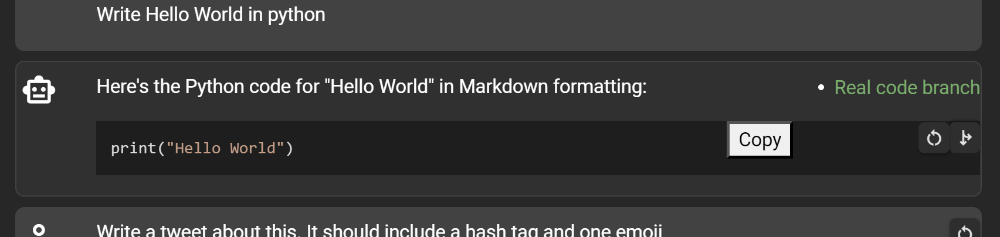
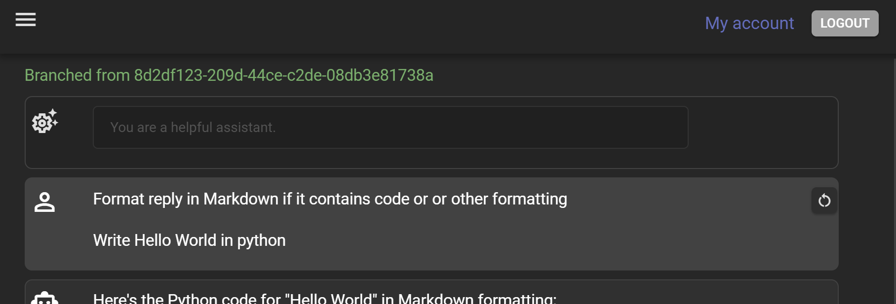

# BlazorGPT

BlazorGPT is a Blazor Server application that uses the ChatGPT 3.5 or ChatGPT-4 API.

## Features
- Chat with GPT-3.5 or GPT-4
  
  
- Create and manage multiple chat sessions with history
  
  
- QuickProfiles for quick access to your favorite text snippet shortcuts
  

- Scripts with mutiple steps for automating a conversation
  
  
- Branching of conversations into side conversations with the same context
  
  

- Restart a conversation from a previous step
- (Developer) Chat pipeline for customizing the chat experience with middlewares and filters


For ChatGPT support it uses the Betalgo OpenAI package available at https://github.com/betalgo/openai This package supports both the OpenAI API and the Azure OpenAI API.

For UI components it uses the Radzen Blazor components available at https://blazor.radzen.com/

## Prerequisites
.NET 7 SDK
SQL Server 
OpenAI API Key (or Azure OpenAI endpoint, resource name and key)

## Setup
1. Create a database in SQL Server. There are two EF contexts in the app that will share this db.
2. Update the connection strings in appsettings.json (secrets.json) in the **BlazorGPT.Web** directory
   ```json
    "ConnectionStrings:BlazorGptDB": "[your connection string]",
    "ConnectionStrings:UserDB": "[your connection string]",
   ```


3. Run the following commands from the **BlazorGPT** directory:

   ```bash 
    dotnet ef database update -s '..\BlazorGPT.Web\' --context BlazorGptDBContext
   ```
   
4. Run the following commands from the **BlazorGPT.Web** directory:
   ```bash
    dotnet ef database update --context ApplicationDbContext
   ```
   

5. Update the OpenAI API Key and primary model in appsettings.json (secrets.json) in the **BlazorGPT.Web** directory
    For OpenAI:
    ```json
    "PipelineOptions:Model": "gpt-3.5-turbo", // or gpt-4
    "OpenAIServiceOptions:ApiKey": "[your api key]]"

    ```
    For Azure OpenAI:
    ```json
    "PipelineOptions:Model": "gpt-4",
    "OpenAIServiceOptions": {
        "ApiKey": "[your api key]",
        "DeploymentId": "[your deployment id]", // model deployment id
        "ResourceName": "[your resource name]]",
        "ProviderType": "Azure",
        "ApiVersion": "2023-03-15-preview"
    }
    ```

6. Run the application from the **BlazorGPT.Web** directory:
   ```bash
    dotnet run
   ```

7. Create a user account and login to the application
