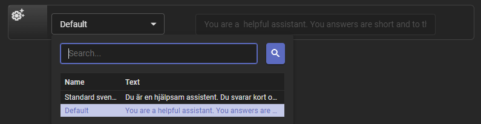
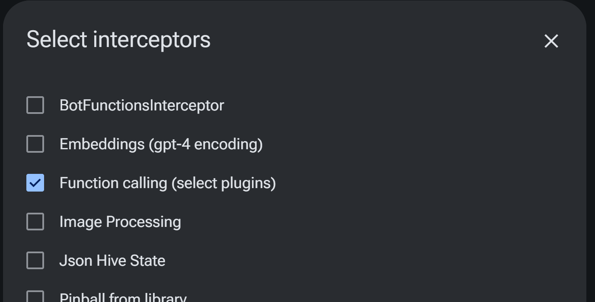
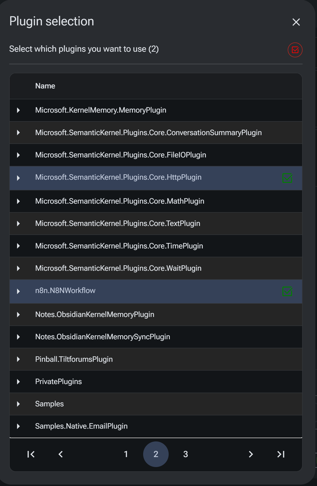

# BlazorGPT

A Blazor Server chat Razor class library and application that uses <a href="https://learn.microsoft.com/en-us/semantic-kernel/overview">Semantic Kernel</a> together with the GPT chat completion and embeddings endpoints available from both OpenAI and MS Azure OpenAI. 
Local model support is provided through [Ollama](https://github.com/jmorganca/ollama). 

- Sqlite and SQL Server databases are supported.
- Leverages ASP.NET Identity for authentication and authorization.
- Create and manage multiple chat sessions with history management. 
- Define your own custom system prompts and switch easily between them.
- QuickProfiles for quick access to your favorite text snippet shortcuts. 
- Scripts with multiple steps for automating a sequence of steps in a conversation. 
- Branch conversations into side conversations sharing the previous context. Inspired by Git.
- Restart a conversation from a previous step. 
- Customize the chat experience with middleware and filters.
- Select Semantic Kernel plugins from GUI with the PluginsInterceptor. Mix semantic (text) and native (code) functions.
- Tools and Function calling. Action log visualizes the function calls and their results.
- Upload and chat with documents using [Kernel Memory](https://github.com/microsoft/kernel-memory)

[GitHub](https://github.com/magols/BlazorGPT)

[Installation instructions](docs/setup.md)

[Developing and using Semantic Kernel plugins](docs/developing.md)

## Features
- GUI models config for chat and embeddings

- Chat with GPT-3.5 or GPT-4, Ollama. Edit and restart chats from previous steps.
  
  
- Define your own custom system prompts

- QuickProfiles for quick access to your favorite text snippet shortcuts
  

- Scripts with mutiple steps for automating a conversation
  
  
- Branching of conversations into side conversations with the same context
  
  

- Select which interceptors to run in pipeline. Use the Function calling interceptor to call functions from the chat.

- Select which plugins to run in pipeline
  

- Manage chat history
  

