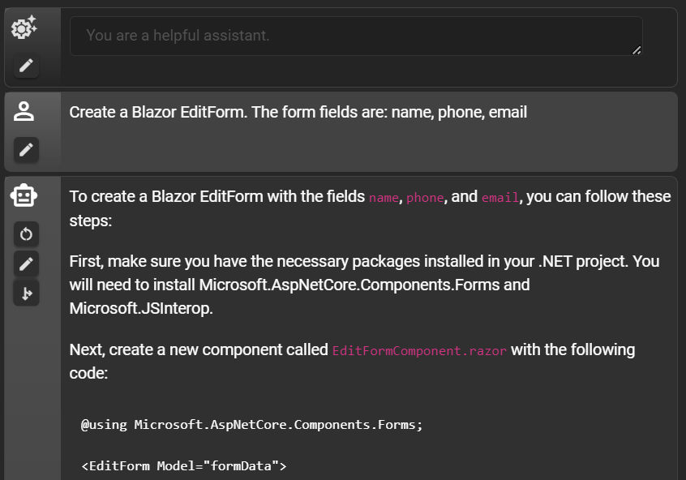
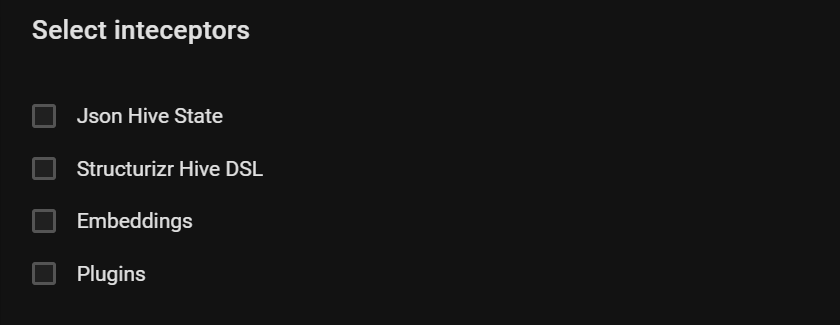
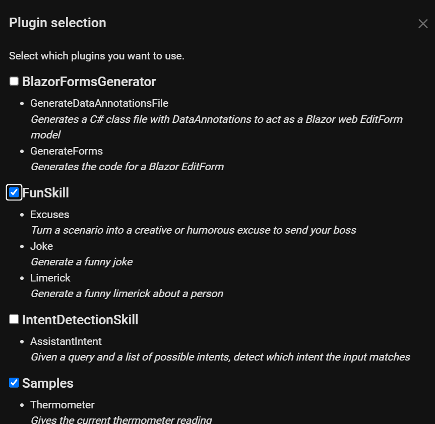

# BlazorGPT

A Blazor Server chat application that uses <a href="https://learn.microsoft.com/en-us/semantic-kernel/overview">Semantic Kernel</a> together with the GPT chat completion and embeddings endpoints available from OpenAI and MS Azure OpenAI. 
Local model support is provided through [Ollama](https://github.com/jmorganca/ollama).

- Create and manage multiple chat sessions with history. 
- QuickProfiles for quick access to your favorite text snippet shortcuts. 
- Scripts with multiple steps for automating a sequence of steps in a conversation. 
- Branch conversations into side conversations sharing the previous context. Inspired by Git.
- Restart a conversation from a previous step. 
- Customize the chat experience with middleware and filters.
- Select Semantic Kernel plugins from GUI with the PluginsInterceptor. Mix semantic (text) and native (code) functions.

Extensible. Create your own plugins in the form of IInterceptors that intercepts the chat messages and modify them before they are sent to the API. 

[GitHub](https://github.com/magols/BlazorGPT)

[Installation instructions](docs/setup.md)

## Features
- GUI models config for chat and embeddings

- Chat with GPT-3.5 or GPT-4, Ollama. Edit and restart chats from previous steps.
  
  

- QuickProfiles for quick access to your favorite text snippet shortcuts
  

- Scripts with mutiple steps for automating a conversation
  
  
- Branching of conversations into side conversations with the same context
  
  

- Select which interceptors to run in pipeline

- Select which plugins to run in pipeline
  

- Manage chat history
  

